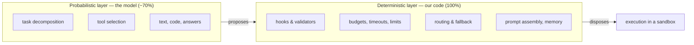
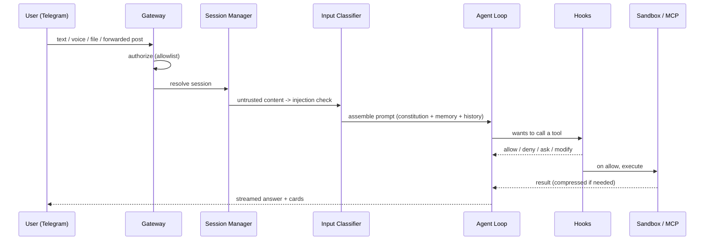

# Architecture

This is the high-level map. Component detail lives in [`docs/specs/`](docs/specs/),
deep explanations in [`docs/concepts/`](docs/concepts/), and the *why* of each
choice in [`docs/decisions/`](docs/decisions/INDEX.md).

## The model is the CPU; the harness is the OS

The language model is a stateless probabilistic processor. The harness is the
deterministic system around it. The dividing line is reversibility.

Three runtime parts live separately so one failing does not take down the rest:
a **stateless core** (our code plus model calls — can crash and resume with no
loss), a **durable session log** (on disk, survives any crash), and **one-shot
sandboxes** (die after a task). A *session* is the full on-disk record; the
*context window* is only the subset the harness chose to show the model this turn.

## How a message flows

## Components

The harness decomposes into twelve components, each with its own spec in
`docs/specs/`:

| # | Component | Responsibility |
|---|---|---|
| 1 | Core / Agent Loop | stateless turn loop, prompt assembly, frozen snapshot, Plan Mode |
| 2 | Gateway / Connectivity | Telegram (grammY), voice (Whisper sidecar), streaming, cards |
| 3 | Memory | four-level file memory, FTS5/BM25, lazy loading, durable forgetting |
| 4 | Tools & Hooks | narrow-waist tool set, Pre/PostToolUse, rtk compression |
| 5 | Safety | HARD_DENY, injection classifier, sandbox, vault, broken trifecta |
| 6 | Skills | SKILL.md, menu-in-prompt, staged creation |
| 7 | MCP | allowlist, version pinning, descriptor hashing, isolation |
| 8 | Personality | SOUL.md, constitution hierarchy, modes, veto |
| 9 | Provider Routing | task-based router, hysteresis fallback, KV-cache economics |
| 10 | Nightly Consolidation | generator + judge, validators, staging, morning approval |
| 11 | Orchestration | coordinator-workers, decision journal, generations, Loop Guardian |
| 12 | Observability & Verification | append-only journal, loop detection, per-step verification by traces |

## Technology

- **Core:** TypeScript / Node.js — the harness is ~90% I/O orchestration
  ([ADR-0004](docs/decisions/2026-06-11-typescript-for-core.md)). Own agent loop,
  not a turnkey SDK ([ADR-0005](docs/decisions/2026-06-11-own-agent-loop.md)).
- **Sidecars:** Python — Whisper voice transcription, optional scoring
  ([ADR-0003](docs/decisions/2026-06-11-monorepo-pnpm-ts-core-py-sidecars.md)).
- **Memory:** markdown in git + SQLite FTS5/BM25; vectors are an optional plugin
  only ([ADR-0006](docs/decisions/2026-06-11-file-based-memory-fts5-bm25.md)).
- **Isolation:** Docker (network none, cap-drop) + optional gVisor
  ([ADR-0012](docs/decisions/2026-06-11-docker-sandbox-default.md)).
- **Extensibility:** MCP under a strict allowlist
  ([ADR-0013](docs/decisions/2026-06-11-mcp-allowlist-pinning-hashing.md)).
- **Packaging:** monorepo, pnpm workspaces
  ([ADR-0003](docs/decisions/2026-06-11-monorepo-pnpm-ts-core-py-sidecars.md)).

## Where to read next

- Why each choice was made → [`docs/decisions/INDEX.md`](docs/decisions/INDEX.md)
- Deep dives → [`docs/concepts/`](docs/concepts/) (memory, safety, MCP, skills, nightly)
- The pipeline that builds this → [`ROADMAP.md`](ROADMAP.md)
- Terms → [`docs/GLOSSARY.md`](docs/GLOSSARY.md)
