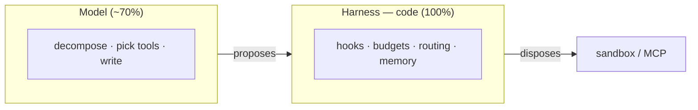

<div align="center">

# Aisy Agent

**An open-source personal AI harness — the OS around the LLM.**

*Durable file memory · deterministic safety · verified self-improvement.*

[Vision](VISION.md) · [Architecture](ARCHITECTURE.md) · [Decisions](docs/decisions/INDEX.md) · [Roadmap](ROADMAP.md) · [Contributing](CONTRIBUTING.md)

</div>

---

> **Status: 0.1.0 (pre-alpha).** The text-first Telegram agent runs end-to-end:
> onboarding, terminal-side pairing, long-polling on a server, durable memory,
> deterministic safety + approvals, sub-agent delegation, nightly consolidation,
> proactive triggers, persistent `/goal` loops, and prefix caching. **Not yet:**
> voice (Whisper), live Skills, and MCP — these are on the [Roadmap](ROADMAP.md).

## What is this?

The language model is a powerful but stateless CPU — it reasons well, forgets
everything, and can err on any step. **Aisy is the operating system around it:**
memory, permissions, scheduling, logging, and model switching. The rule the
whole thing rests on:

> **Reversible and creative work goes to the model. Irreversible and critical
> work is decided by code.**

Code hooks run 100% of the time; prompt instructions run about 70%. So deleting
data, moving money, and deploying never depend on whether the model paid
attention.

## Why another harness?

Existing personal harnesses force a trade: mature ones have weak loop guards,
silent background failures, and memory that doubles as an injection surface;
ambitious ones grow skills but learn only from successes and let the model grade
its own homework. Aisy fixes the hard parts by construction. See [VISION.md](VISION.md).

## Key features

- 🧠 **Durable, portable memory** — markdown in git + SQLite FTS5/BM25. Human-
  readable, editable, survives an LLM swap. **Deletions stick:** a forget-list
  and tombstones make "forget this" permanent, and the nightly loop can never
  resurrect it.
- 🛡️ **Safe by construction** — deterministic Pre/PostToolUse hooks, a sandbox
  with no network, secrets in a vault, and a broken [lethal trifecta](docs/concepts/safety-layer.md).
- 🌙 **Verified self-improvement** — a nightly generator drafts skills, a
  *separate* judge plus deterministic validators check them, and nothing reaches
  production without verification and a human tap.
- 🔀 **Model- and provider-resilient** — a router picks the right model per task
  and falls back on sustained errors; identity lives in `SOUL.md`, not a vendor.
- 🔌 **Extensible via MCP** — under a strict allowlist with version pinning and
  descriptor hashing against tool poisoning.
- 📟 **Reachable where you are** — Telegram and IDE, voice or text, with
  proactive cards for approvals and reports.

## Quickstart

Single-operator by design: the bot answers exactly one paired Telegram chat.
You need a [Telegram bot token](https://core.telegram.org/bots#botfather) and at
least one LLM provider key (Anthropic, OpenAI, DeepSeek, OpenRouter, Qwen, GLM,
Gemini, or any OpenAI-compatible endpoint). Requires **Node 22+**.

**Install from npm (recommended):**

```bash
npm install -g @aisy/app     # provides the `aisy` command  (or: npx @aisy/app <cmd>)

aisy init                    # interactive: provider key(s) + Telegram token + pairing
aisy doctor                  # full-stack health check (read-only)
aisy run                     # boot the bot (long-polling — works behind NAT / on any VPS)
```

Pairing happens **in the terminal** during `aisy init`: a code is shown there,
you send it to the bot, and only the chat that echoes the matching code is
allowed. A pairing request that arrives *as a Telegram message* is never trusted
(prompt-injection guard) — trust is established terminal-side only.

**From source (dev loop):**

```bash
git clone <this-repo> && cd aisy-harness
./scripts/install.sh         # checks prerequisites (Node 22, pnpm ≥9), installs, builds
cp .env.example .env         # or run `aisy init` to fill it interactively
pnpm --filter @aisy/app exec aisy run
```

**Docker / Compose** (self-host; bundles the runtime, secrets stay in a
git-ignored `.env`, never in the image):

```bash
cp .env.example .env         # provider key(s), AISY_TELEGRAM_BOT_TOKEN, AISY_TELEGRAM_CHAT_ID
docker compose up --build    # builds the image and runs `aisy run`
```

> Pair before the first Docker `up` (run `aisy init` once, or
> `docker compose run --rm aisy init`) so `AISY_TELEGRAM_CHAT_ID` is set. The bash
> sandbox is opt-in via `AISY_SANDBOX_IMAGE` (mounts the host Docker socket —
> trusted hosts only). Voice, Skills, and MCP are not wired in 0.1.0; voice is
> served by multimodal providers or a self-installed transcriber.

## Architecture at a glance



Full picture in [ARCHITECTURE.md](ARCHITECTURE.md).

## Repository layout

```
packages/core-ts/      # the harness core (TypeScript)
packages/sidecars-py/  # Python sidecars (Whisper, optional scoring)
packages/sdk-ts/  sdk-py/   # client SDKs
docs/decisions/        # ADRs (MADR 3.0) — why every choice was made
docs/specs/            # one spec per component
docs/concepts/         # deep dives: memory, safety, MCP, skills, nightly
docs/guides/           # quick-start, dev setup, deployment
```

## Documentation

- **Start here:** [VISION.md](VISION.md) → [ARCHITECTURE.md](ARCHITECTURE.md)
- **Decisions:** [docs/decisions/INDEX.md](docs/decisions/INDEX.md)
- **Concepts:** [memory](docs/concepts/memory-system.md) ·
  [safety](docs/concepts/safety-layer.md) ·
  [MCP](docs/concepts/mcp-integration.md) ·
  [skills](docs/concepts/skill-lifecycle.md) ·
  [nightly consolidation](docs/concepts/nightly-consolidation.md)
- **Build & run:** [DEVELOPMENT.md](DEVELOPMENT.md) · [CONTRIBUTING.md](CONTRIBUTING.md) · [SECURITY.md](SECURITY.md)

## License

[Apache-2.0](LICENSE) — chosen for its explicit patent grant; see
[ADR-0002](docs/decisions/2026-06-11-apache-2-0-license.md).
