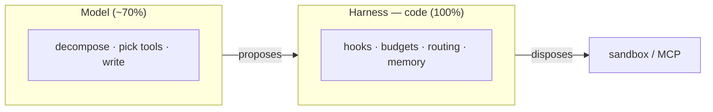

<div align="center">

# Aisy Agent

**An open-source personal AI harness — the OS around the LLM.**

*Durable file memory · deterministic safety · verified self-improvement.*

[Vision](VISION.md) · [Architecture](ARCHITECTURE.md) · [Decisions](docs/decisions/INDEX.md) · [Roadmap](ROADMAP.md) · [Contributing](CONTRIBUTING.md)

</div>

---

> **Status: 0.1.14 (pre-alpha).** The Telegram-first production composition
> includes text and media ingress, streaming, durable scoped memory, verified
> tools, active Skills, allowlisted stdio MCP, supervised sub-agents, monitoring,
> nightly consolidation and persistent `/goal` loops. Voice and native API
> providers use separate root-owned brokers and still require explicit operator
> enrollment and target acceptance. See the current
> [production matrix](docs/reviews/2026-08-23-production-readiness-matrix.md).

## What is this?

The language model is a powerful but stateless CPU — it reasons well, forgets
everything, and can err on any step. **Aisy is the operating system around it:**
memory, permissions, scheduling, logging, and model switching. The rule the
whole thing rests on:

> **Reversible and creative work goes to the model. Irreversible and critical
> work is decided by code.**

Code hooks run 100% of the time; prompt instructions run about 70%. So deleting
data, moving money, and deploying never depend on whether the model paid
attention.

## Why another harness?

Existing personal harnesses force a trade: mature ones have weak loop guards,
silent background failures, and memory that doubles as an injection surface;
ambitious ones grow skills but learn only from successes and let the model grade
its own homework. Aisy fixes the hard parts by construction. See [VISION.md](VISION.md).

## Key features

- 🧠 **Durable, portable memory** — markdown in git + SQLite FTS5/BM25. Human-
  readable, editable, survives an LLM swap. **Deletions stick:** a forget-list
  and tombstones make "forget this" permanent, and the nightly loop can never
  resurrect it.
- 🛡️ **Safe by construction** — deterministic Pre/PostToolUse hooks, a sandbox
  with no network, secrets in a vault, and a broken [lethal trifecta](docs/concepts/safety-layer.md).
- 🌙 **Verified self-improvement** — a nightly generator and a separate judge
  stage memory proposals behind deterministic validators and a human tap;
  demonstrated workflows use a separate evidence-and-grant path. Automatic
  Skill drafting is not part of the live path yet.
- 🔀 **Model- and provider-resilient** — a router picks the right model per task
  and falls back on sustained errors; identity lives in `SOUL.md`, not a vendor.
- 🔌 **Extensible via MCP** — under a strict allowlist with version pinning and
  descriptor hashing against tool poisoning.
- 📟 **Reachable where you are** — Telegram-first, voice or text, with proactive
  cards for approvals and reports. A shared IDE surface remains future work.

## Quickstart

Single-operator by design: the bot answers exactly one paired Telegram chat.
You need a [Telegram bot token](https://core.telegram.org/bots#botfather) and at
least one supported LLM provider key (Anthropic, OpenAI, DeepSeek, OpenRouter,
Qwen, GLM or Gemini), or a supported subscription CLI installed on the host.
Arbitrary OpenAI-compatible origins are deliberately not accepted. Requires
**Node 22+**.

**Managed install (recommended):**

```bash
curl -fsSL https://raw.githubusercontent.com/veeskelad/aisy-agent/master/scripts/install.sh | bash

aisy init                    # interactive: provider key(s) + Telegram token + pairing
aisy doctor                  # full-stack health check (read-only)
aisy run                     # boot the bot (long-polling — works behind NAT / on any VPS)
```

Pairing happens **in the terminal** during `aisy init`: a code is shown there,
you send it to the bot, and only the chat that echoes the matching code is
allowed. A pairing request that arrives *as a Telegram message* is never trusted
(prompt-injection guard) — trust is established terminal-side only.

The managed layout supports verified descendant updates, offline rollback and
exact cleanup through `aisy update`, `aisy update --rollback` and
`aisy update --cleanup`. npm remains an optional local channel.

**From source (dev loop):**

```bash
git clone <this-repo> && cd aisy-harness
corepack pnpm install --frozen-lockfile
corepack pnpm -r build
cp .env.example .env         # or run `aisy init` to fill it interactively
pnpm --filter @aisy/app exec aisy run
```

**Run as a service (systemd):**

```ini
# /etc/systemd/system/aisy.service
[Unit]
Description=Aisy agent
After=network-online.target

[Service]
ExecStart=/home/aisy/.local/bin/aisy supervise
WorkingDirectory=/home/aisy
EnvironmentFile=/home/aisy/.env
Restart=on-failure
User=aisy

[Install]
WantedBy=multi-user.target
```

```bash
sudo systemctl enable --now aisy     # boot + restart-on-failure
journalctl -u aisy -f                # logs
```

> Long-polling means no inbound ports — Aisy runs behind NAT / on any VPS. The
> bash sandbox is **opt-in** via `AISY_SANDBOX_IMAGE` (the only thing that needs
> Docker — it mounts the host Docker socket, trusted hosts only). Skills and
> allowlisted stdio MCP are live. Cloud voice and native API providers require
> their explicit TTY enrollment; HTTP MCP and arbitrary provider origins remain
> disabled.

## Architecture at a glance


```mermaid
flowchart LR
    subgraph PROB["Model (~70%)"]
        P["decompose · pick tools · write"]
    end
    subgraph DET["Harness — code (100%)"]
        H["hooks · budgets · routing · memory"]
    end
    PROB -->|proposes| DET -->|disposes| EX["sandbox / MCP"]
```

Full picture in [ARCHITECTURE.md](ARCHITECTURE.md).

## Repository layout

```
packages/core-ts/      # the harness core (TypeScript)
packages/sidecars-py/  # Python sidecars (Whisper, optional scoring)
packages/sdk-ts/  sdk-py/   # client SDKs
docs/decisions/        # ADRs (MADR 3.0) — why every choice was made
docs/specs/            # one spec per component
docs/concepts/         # deep dives: memory, safety, MCP, skills, nightly
docs/guides/           # quick-start, dev setup, deployment
```

## Documentation

- **Start here:** [VISION.md](VISION.md) → [ARCHITECTURE.md](ARCHITECTURE.md)
- **Decisions:** [docs/decisions/INDEX.md](docs/decisions/INDEX.md)
- **Concepts:** [memory](docs/concepts/memory-system.md) ·
  [safety](docs/concepts/safety-layer.md) ·
  [MCP](docs/concepts/mcp-integration.md) ·
  [skills](docs/concepts/skill-lifecycle.md) ·
  [nightly consolidation](docs/concepts/nightly-consolidation.md)
- **Build & run:** [DEVELOPMENT.md](DEVELOPMENT.md) · [CONTRIBUTING.md](CONTRIBUTING.md) · [SECURITY.md](SECURITY.md)

## Releasing

Releases are **tag-driven** — CI builds and publishes; no manual `pnpm publish`.

1. Add the version's entry to [CHANGELOG.md](CHANGELOG.md).
2. `scripts/release.sh X.Y.Z` — bumps every package version, commits, tags `vX.Y.Z`, pushes.

Pushing a `v*` tag triggers `.github/workflows/release.yml`, which runs the gates,
`pnpm -r publish --provenance` to npm (so the packages show "Built and signed on GitHub
Actions"), and cuts the GitHub Release. Requires the `NPM_TOKEN` repo secret to hold a
granular **read-write + bypass-2FA** npm token.

## License

[Apache-2.0](LICENSE) — chosen for its explicit patent grant; see
[ADR-0002](docs/decisions/2026-06-11-apache-2-0-license.md).
