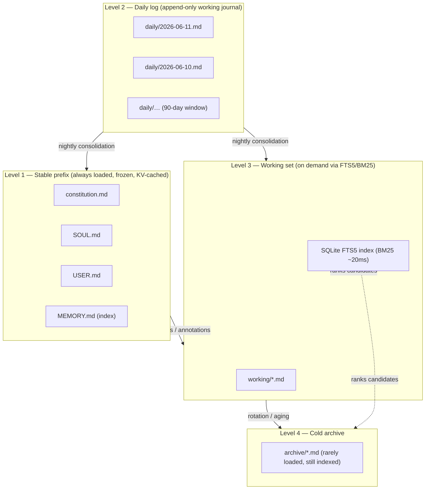
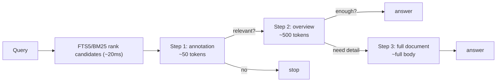
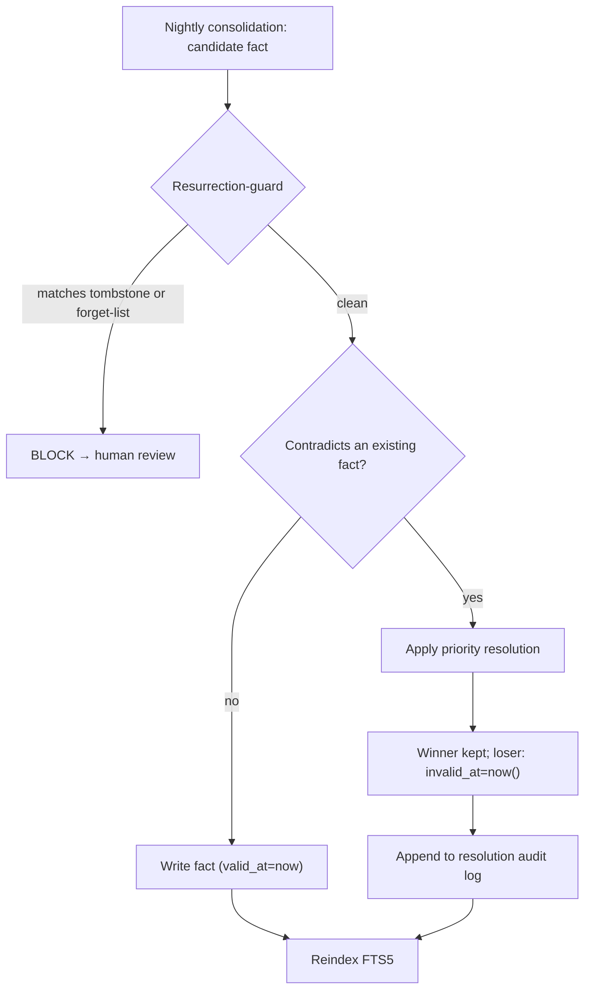

# Memory System

Aisy's memory is the part of the OS that survives the CPU. The LLM is a stateless,
probabilistic processor — it forgets everything the moment a request returns. The
harness gives it a durable, human-readable, git-versioned substrate to read from and
write to, so the *agent* persists even though the *model* does not. This document
explains how that substrate is structured: four storage levels, a frozen per-session
snapshot, three-step lazy loading with its token math, rotation/hygiene policy, and
the durable-forgetting machinery that makes "delete" actually stick.

The decisions behind each piece live in ADRs; they are cross-referenced inline.

---

## 1. Design constraints

Five constraints shape every choice below:

1. **Human-readable and hand-editable.** The owner directly inspects and corrects
   memory. Opaque float blobs (vectors) fail this; markdown passes.
2. **Portable across models and engines.** Memory must survive a provider swap
   (Opus → Sonnet → DeepSeek) and an engine swap. Plain files in git are portable;
   a provider-specific store is not.
3. **Auditable.** Every change must be diffable and reversible. Git history plus
   bi-temporal soft-delete gives a full, recoverable audit trail.
4. **Cheap to retrieve.** No per-query embedding inference, no extra running
   service, no network round-trip. SQLite FTS5 with BM25 ranking answers in ~20ms,
   in-process, zero LLM calls.
5. **Deterministic where it matters.** Forgetting and contradiction resolution are
   code (100% adherence), never prompt instructions (~70%). NIST requires at least
   one deterministic enforcement layer not judged by an LLM.

Vector search is explicitly **not** the basis of memory. ByteDance's OpenViking
abandoned vector-as-memory-basis in 2026 and moved to a file paradigm; embeddings
add inference cost, a separate service, 200ms+ latency, and non-diffable storage. A
vector index exists only as an optional, flag-gated plugin for large fuzzy-semantic
corpora where lexical recall genuinely falls short — and even then it is a derived,
disposable artifact rebuilt from the canonical files. See
[ADR-0006](../decisions/2026-06-11-file-based-memory-fts5-bm25.md).

---

## 2. The four levels

Memory is layered by *volatility* and *access pattern*. Stable, identity-defining
text sits at the top and is always loaded; volatile, query-specific text sits below
and is pulled on demand.



### Level 1 — Always-loaded stable prefix (~9–10k tokens)

Four files form the identity prefix that sits at the head of **every** request:

- **`constitution.md`** — the non-negotiable rules of behavior, safety posture, and
  the autonomy gradient. This is the deterministic spine the model reads first.
- **`SOUL.md`** — persona, voice, values, self-model (in the spirit of the
  ANIMA_SDK `SELF_MODEL.md`/`AGENTS.md` format — borrowed *format*, not code).
- **`USER.md`** — durable facts about the single owner: preferences, projects,
  standing instructions, relationships.
- **`MEMORY.md`** — a compact index (≤200 lines) into the rest of the memory bank,
  not the bank itself. Details live in separate files; this is the table of contents.

This layer is the cacheable prefix. It must stay byte-identical for the whole session
(see §3), which is why it is read once and frozen.

### Level 2 — Daily log

`daily/YYYY-MM-DD.md` is the append-only working journal for the current day. Raw
observations, decisions, and events land here first. It is the *source* for nightly
consolidation, which promotes durable facts up into Level 1/3 and writes corrections
through the forgetting machinery (§6). Daily logs are retained for 90 days, then
rotated to archive.

### Level 3 — Working set + FTS5/BM25

`working/*.md` holds active, topic-scoped documents (a project's notes, a running
investigation, a skill's accumulated lessons). These are **not** loaded by default.
The SQLite FTS5 index ranks them by BM25 relevance against the live query, and the
three-step lazy loader (§4) pulls in only as much of a hit as the current step needs.
Every FTS5 row carries the bi-temporal columns and is filtered on read (§6).

### Level 4 — Cold archive

`archive/*.md` is aged-out content: old daily logs, retired working docs, superseded
material. Still indexed (so it remains searchable), but it ranks lower and is rarely
loaded. This is the long tail — present for recall, absent from the hot path.

| Level | Path | Loaded | Retrieval | Lifecycle |
|------|------|--------|-----------|-----------|
| 1 Stable prefix | `constitution.md`, `SOUL.md`, `USER.md`, `MEMORY.md` | Always (frozen) | Direct, KV-cached | Edited via consolidation/owner |
| 2 Daily | `daily/YYYY-MM-DD.md` | Current day partially | Direct + FTS5 | 90-day window → archive |
| 3 Working | `working/*.md` | On demand | FTS5/BM25 + lazy loader | Aged to archive when stale |
| 4 Archive | `archive/*.md` | Rarely | FTS5/BM25 | Long-term cold storage |

---

## 3. The frozen snapshot

A million-token context window is per-turn *input capacity*, not storage — and the
stable prefix is re-sent on every request. KV-cache reuse gives up to ~90% input
savings, but only while that prefix is **byte-identical** for the whole session. A
single mutation invalidates the cache from the changed position onward, and the
provider re-bills the entire prefix at full input rate. Anthropic supports up to 4
cache breakpoints with a ~1024–2048 token minimum, so the prefix must be large and
stable enough to land on a breakpoint.

The agent, however, writes to memory *during* a session. If those writes flowed back
into the live prefix mid-session, every write would bust the cache and inflate cost,
while turning the prompt into a moving target within a single reasoning run.

The resolution: **read the always-loaded layer once at session start and freeze that
snapshot for the entire session.** Within-session writes go to disk immediately
(durable the moment they hit the filesystem — no end-of-session flush to lose on a
crash), but are **not** re-read into the live prefix. They take effect next session,
which reads a fresh snapshot.

```mermaid
sequenceDiagram
    participant S as Session start
    participant Snap as Frozen snapshot (prefix)
    participant Disk as Disk (files + FTS5)
    participant Run as Reasoning turns

    S->>Disk: read L1 once
    Disk-->>Snap: freeze byte-identical prefix
    loop every turn
        Run->>Snap: reuse KV-cache (~90% input saved)
        Run->>Disk: write new fact (durable now)
        Note over Snap: prefix unchanged — cache intact
    end
    Run->>Disk: explicit FTS5 search
    Disk-->>Run: surfaces this-session writes
    Note over Snap,Disk: New fact NOT in prefix this session;<br/>appears in next session's snapshot
```

The key nuance: a fact written *now* is invisible in the frozen always-loaded prefix
until the next session, but it is **not truly invisible** — it lives on disk and in
the FTS5 layer, so explicit search surfaces it the same session. Only the stable
prefix is frozen; daily/working content is still reachable via the lazy loader. See
[ADR-0007](../decisions/2026-06-11-frozen-memory-snapshot.md).

---

## 4. Three-step lazy loading

Filling the context window is not free even when it fits. Long context degrades
through known failure modes: **poisoning** (a bad fact contaminates later reasoning),
**inertia** (the model anchors on stale loaded text), and **distraction** (signal
drowns in irrelevant volume). Loading an entire working-memory document to answer one
question is therefore wrong on two axes — it costs tokens *and* lowers answer quality.

So below the stable prefix, nothing enters the prompt by default. Documents load in
three escalating steps, stopping as soon as the step in hand has enough:



1. **Annotation (~50 tokens)** — one line: what the document is, when it was last
   valid. The query first sees only the annotations of ranked hits.
2. **Overview (~500 tokens)** — key facts and structure. Pulled only if the
   annotation looks relevant.
3. **Full document** — the complete body. Loaded only when the overview is
   insufficient.

FTS5/BM25 decides which documents are *candidates*; the model decides whether to
*deepen*. Annotations and overviews are generated on write/consolidation (not
hand-maintained) and must be regenerated whenever the body changes — a stale
annotation can hide a relevant document (a false negative), and bi-temporal
`invalid_at` filtering must apply at every step.

### Token math

| Approach | Tokens per resolved query | Notes |
|---|---|---|
| Load whole file on any hit | ~10,000 | Blows budget; actively poisons/distracts |
| Annotation only (Step 1) | ~50 | Most queries resolve or reject here |
| Annotation + overview (Step 2) | ~550 | Common deep-enough case |
| Full document (Step 3) | ~10,000 | Reserved for the few queries that need it |
| **Averaged over real traffic** | **~550** | **≈ 95% saved vs. loading whole files** |

This is **economy by architecture, not by compression**: nothing we load is lossily
summarized — we simply refuse to load what we don't need. See
[ADR-0008](../decisions/2026-06-11-three-step-lazy-memory-loading.md).

---

## 5. Rotation and hygiene

Memory left unbounded rots: it accumulates stale facts, bloats the index, and (worst)
feeds resurrection of deleted material through un-cleaned logs. Rotation is a code job
(part of nightly consolidation), not a prompt instruction.

| Content | Hot window | Action after window | Rationale |
|---|---|---|---|
| Daily logs (`daily/*.md`) | 90 days | Rotate to `archive/` | Recent days drive consolidation; older days are cold recall |
| Skill lessons — transient | 30 days | Prune unless reinforced | A one-off failure must not fossilize into learned helplessness |
| Skill lessons — durable | 90 days | Promote or archive | Repeatedly reinforced lessons graduate to stable memory |
| Session transcripts | 14 days | Discard / archive | Raw turn-by-turn logs are debug material, not durable memory |

Two hygiene rules matter beyond the table:

- **Daily logs are cleaned, not just archived.** Consolidation must scrub facts that
  were forgotten/superseded out of the logs it reads, or the next nightly pass
  re-derives them — the exact mechanism behind the original deletion bug (§6).
- **Transient vs. durable failure.** A skill that failed once because of a flaky
  network must not record "this never works." Distinguishing transient from permanent
  failure prevents a fossilized "learned helplessness" entry from surviving the 30-day
  prune. (See the transient-vs-permanent-failure ADR for the skills side of this.)

---

## 6. Durable forgetting

The motivating incident: *"I asked Aisy to delete a memory, and it came back."* A
deleted fact resurfaced because the harness had no durable negation primitive. Several
root causes were present at once:

- **Append-only logs re-derived.** Nightly consolidation re-extracted the deleted fact
  from un-cleaned daily logs, silently resurrecting it.
- **Stale FTS5 index.** The BM25 index was not reindexed on delete, so the fact stayed
  queryable even after the markdown was edited.
- **Frozen snapshot / KV-cache.** The within-session snapshot held the stale prefix;
  the "deletion" only existed in volatile state.
- **No tombstone, no forget-list.** Nothing recorded the *intent to forget* in a form
  that survives a rewrite or a consolidation pass.
- **No contradiction resolution.** Even with both "X" and "not X" present, nothing
  decided which was current; BM25 ranks on lexical relevance, not truth.

Public precedent confirms the bug class (per-memory delete missing — only nuke the
whole bank; removal not forwarded to the external index; KV-cache invalidation gaps;
a skill fossilized from a transient failure). The fix borrows proven semantics from
Zep/Graphiti (bi-temporal `valid_at`/`invalid_at`), mem0 (ADD/UPDATE/DELETE/NOOP),
and the Anthropic memory tool — without importing their code.

### The negation primitives

Forgetting is **code, not prompt** (NIST: at least one deterministic, non-LLM
enforcement layer). Five mechanisms work together:

1. **Bi-temporal facts.** Every fact carries `valid_at`, `invalid_at`, and
   `is_human_confirmed`. A fact is live **iff** `invalid_at IS NULL`.
2. **Soft-delete, not erasure.** Deletion sets `invalid_at = now()`; the row is kept
   for audit and contradiction history but excluded from all reads. No hard `DELETE` —
   hard delete destroys the audit trail and does nothing to stop re-derivation.
3. **Forget-list (`do_not_remember`).** An explicit table of `(id, reason, timestamp)`
   that survives any log rewrite, consolidation, or snapshot rebuild. This is *the*
   negation primitive — append-only logs alone have no way to express "forget X."
4. **FTS5 invariant.** Every search query filters
   `WHERE invalid_at IS NULL AND id NOT IN (SELECT id FROM do_not_remember)`, and the
   index is reindexed on every change so no stale BM25 row survives.
5. **Resurrection-guard validator.** A deterministic check runs *before* any
   nightly-consolidation commit. If a candidate fact matches a tombstone
   (`invalid_at` set) or a forget-list entry, the commit is **blocked** and routed to
   human review — it never lands silently.

Human-confirmed deletions are **permanent**: once `is_human_confirmed` is set on a
deletion, no automated path (recency, source-authority, confidence) may resurrect it.



### Contradiction resolution

When two facts disagree, a **fixed priority order** decides the winner — at
write/consolidation time, not query time, so it is a 100% deterministic code decision
on the cold path, never an LLM judgment on the hot read path:

> **human-confirmed > recency > source-authority > confidence**

A correction *supersedes*: the old fact gets `invalid_at` set and the new fact is
written `is_human_confirmed`, rather than both versions living side by side. Because
the retriever already filters out non-live and forgotten rows, superseded facts drop
out of BM25 ranking entirely — the index converges to a single current truth per
fact. Every resolution is appended to an audit log (winning id, losing id, rule that
fired, timestamp). A human-confirmed fact can only be overturned by another
human-confirmed fact; recency does not beat it.

| Priority | Tier | Beats below it because… |
|---|---|---|
| 1 | Human-confirmed | The owner explicitly asserted it; permanence guarantee |
| 2 | Recency | A newer assertion usually reflects current state |
| 3 | Source-authority | A trusted source outranks an incidental mention |
| 4 | Confidence | Last-resort tiebreak on ingest-time confidence score |

If source-authority and confidence are not populated at ingest, the lower two tiers
degrade gracefully to "recency only." See
[ADR-0023](../decisions/2026-06-11-durable-forgetting-tombstones.md) (tombstones +
forget-list + bi-temporal) and
[ADR-0024](../decisions/2026-06-11-memory-contradiction-resolution.md) (resolution
policy).

---

## 7. How the pieces interlock

The four levels, the frozen snapshot, lazy loading, and durable forgetting are not
independent features — they constrain each other:

- **Frozen snapshot ↔ forgetting.** Because the prefix is frozen for KV-cache, a
  deletion can't take effect mid-session in the prefix. The forget-list and FTS5
  filter ensure that even within the session, explicit search won't surface the
  forgotten fact, and next session's fresh snapshot reflects the deletion.
- **Lazy loading ↔ bi-temporal filter.** The `invalid_at` filter applies at *every*
  one of the three load steps, so a tombstoned fact never enters even as a 50-token
  annotation.
- **Rotation ↔ forgetting.** Cleaning daily logs (not just archiving them) is what
  stops nightly consolidation from re-deriving a deleted fact; the resurrection-guard
  is the backstop if a log slips through.
- **Files canonical ↔ FTS5/vectors derived.** The markdown files are the single
  source of truth. The FTS5 index — and any optional vector index — are derived
  artifacts, rebuilt from the files, never authoritative.

The net effect: an agent whose memory is human-readable, portable, auditable, cheap to
query, and — critically — capable of forgetting on purpose and keeping it forgotten.

---

## Referenced ADRs

| ADR | Topic |
|---|---|
| [ADR-0006](../decisions/2026-06-11-file-based-memory-fts5-bm25.md) | File-based memory with SQLite FTS5/BM25 |
| [ADR-0007](../decisions/2026-06-11-frozen-memory-snapshot.md) | Frozen memory snapshot per session |
| [ADR-0008](../decisions/2026-06-11-three-step-lazy-memory-loading.md) | Three-step lazy memory loading |
| [ADR-0023](../decisions/2026-06-11-durable-forgetting-tombstones.md) | Durable forgetting: tombstones + forget-list + bi-temporal |
| [ADR-0024](../decisions/2026-06-11-memory-contradiction-resolution.md) | Memory contradiction resolution policy |
