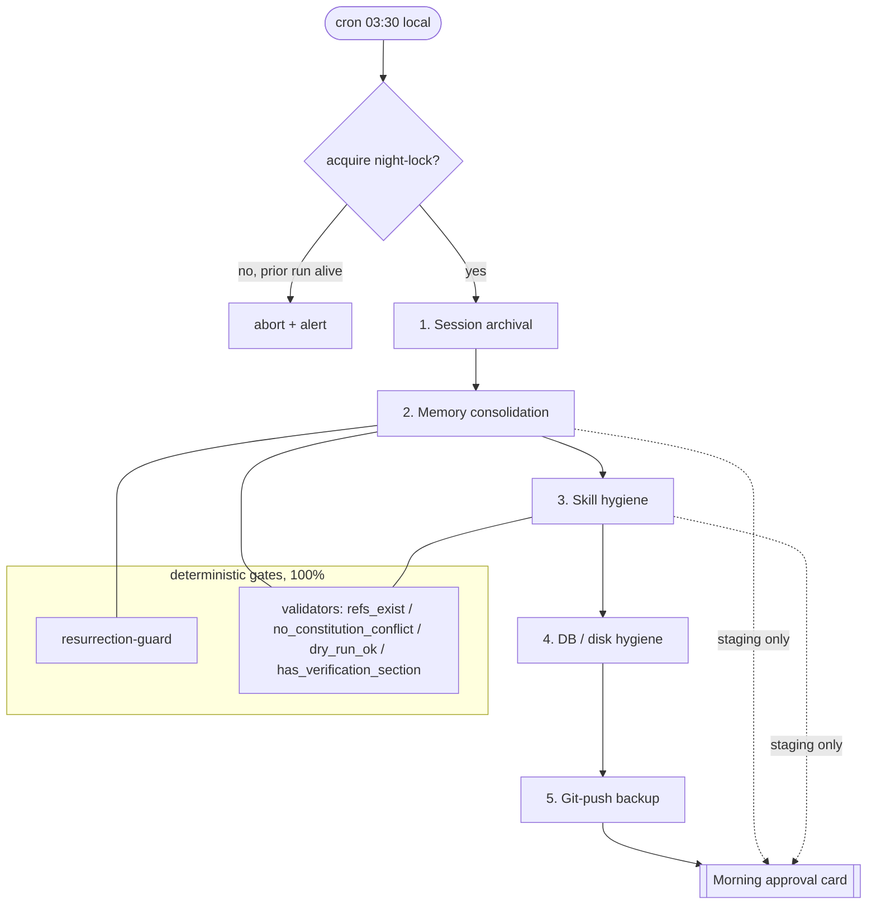
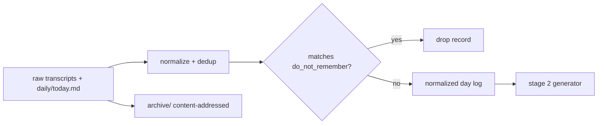
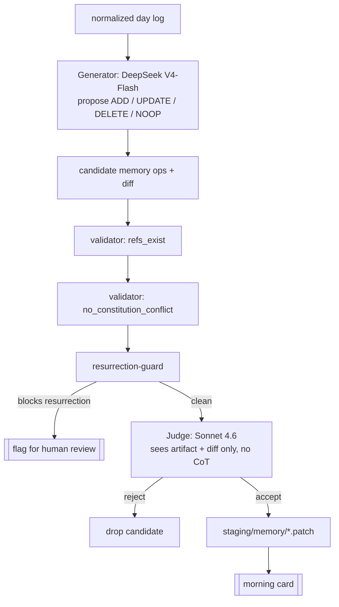
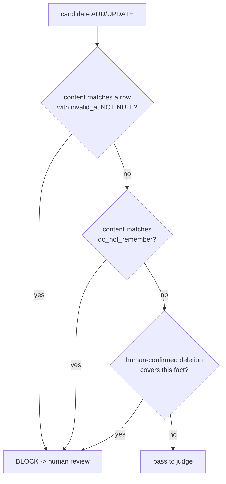
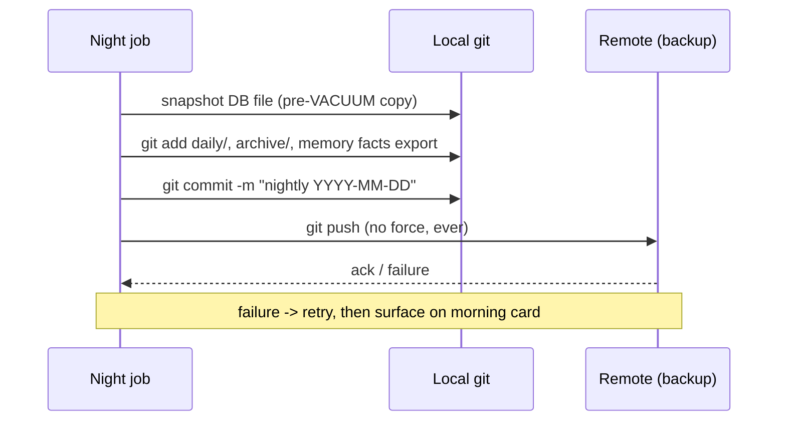

# Nightly Consolidation

> The deterministic OS, not the probabilistic CPU, owns the night. The model
> *proposes* during the day; at 03:30 a code-driven pipeline *disposes* — it
> archives sessions, distills memory, prunes skills, reclaims disk, and pushes a
> backup. Every step that is irreversible (deleting a fact, dropping a skill,
> running `VACUUM`, force-pruning Docker) is gated by code, never by a prompt.

Aisy's daily cycle ends with a single batch job run by cron at **03:30 local
time**. The hour is not cosmetic: provider **batch tariffs** (~50% off
synchronous rates) make the heavy generator pass cheap, the user is asleep so
latency is irrelevant, and the day's logs are complete and quiescent — no live
session is mutating state.

This document explains the whole pipeline end to end: what runs, in what order,
which model (if any) touches each stage, where the deterministic gates sit, and
how the **resurrection-guard** stops a "deleted" memory from crawling back —
the exact bug the owner once hit ("I asked it to delete, it came back").

Related decisions:

- [ADR-0016 — Generator + Separate Judge for Self-Learning](../decisions/2026-06-11-generator-judge-self-learning.md)
- [ADR-0017 — External Verification by Real Traces](../decisions/2026-06-11-external-verification-by-traces.md)
- [ADR-0023 — Durable Forgetting: Tombstones + Forget-List + Bi-temporal](../decisions/2026-06-11-durable-forgetting-tombstones.md)
- Supporting: [ADR-0006 (FTS5/BM25 memory)](../decisions/2026-06-11-file-based-memory-fts5-bm25.md),
  [ADR-0007 (frozen snapshot)](../decisions/2026-06-11-frozen-memory-snapshot.md),
  [ADR-0015 (staged skills)](../decisions/2026-06-11-skill-format-staged-creation.md),
  [ADR-0024 (contradiction resolution)](../decisions/2026-06-11-memory-contradiction-resolution.md),
  [ADR-0025 (transient-vs-permanent skill failure)](../decisions/2026-06-11-transient-vs-permanent-skill-failure.md).

---

## 1. Why a nightly batch at all

A personal agent that runs all day accumulates entropy: chat transcripts pile up,
the same fact gets restated five ways, skills get learned from one-off failures,
SQLite bloats, Docker leaves dead layers, worktrees fossilize. None of this can be
fixed *inside* a live session without invalidating the frozen memory snapshot and
the KV-cache (see [ADR-0007](../decisions/2026-06-11-frozen-memory-snapshot.md)):
within-session writes are deliberately *deferred* so the stable prefix stays
byte-identical and earns ~90% input savings. The nightly job is where those
deferred writes are *applied* — once, atomically, while nothing is reading.

| Property | Value | Why it matters |
|---|---|---|
| Trigger | cron, 03:30 local | User asleep; logs complete and idle |
| Tariff | Provider **batch** (~50% off sync) | Generator pass is the cost driver |
| Generator model | DeepSeek V4-Flash ($0.14 / $0.28 per 1M) | Routine high-volume drafting |
| Judge model | Sonnet 4.6 ($3 / $15 per 1M) | Independent, sharper, different provider |
| Determinism budget | 100% of irreversible ops | Code gates, not the model |
| Wall-clock target | < 20 min typical | Finishes long before morning |
| Output to user | One **morning approval card** | Nothing ships to prod unattended |

The guiding principle is the project thesis: the LLM is a ~70%-adherent
probabilistic CPU; the harness is the 100%-deterministic OS. The night is mostly
OS work. The model appears in exactly two bounded places — as a **generator**
(draft candidates) and as a separate **judge** (grade candidates) — and never as
the thing that decides to actually delete, drop, prune, or push.

---

## 2. Pipeline overview



Stages run **sequentially** and **idempotently**. The job takes a single
exclusive lock (`night.lock`) so two runs can never overlap; a stale lock from a
crashed prior run is detected by PID liveness, not blindly stolen. Each stage is
restartable: re-running the whole pipeline on a partially-completed night
produces the same end state (archival is content-addressed, consolidation works
off a snapshot, hygiene ops are no-ops when already clean).

A hard rule: **stages 2 and 3 only write to `staging/`**. They never mutate the
live constitution, live memory tables, or the live `skills/` directory. The only
thing that promotes staged artifacts to prod is the human tapping *Approve* on
the morning card. This is the cash-out of [ADR-0015](../decisions/2026-06-11-skill-format-staged-creation.md)
and [ADR-0016](../decisions/2026-06-11-generator-judge-self-learning.md):
agent-authored changes are proposals, not deployments.

---

## 3. Stage 1 — Session archival

The day's live working set is `daily/YYYY-MM-DD.md` plus any `working/` scratch
documents and the raw conversation transcripts. Archival does three things:

1. **Freeze the transcript.** Each completed session transcript is written to
   `archive/sessions/YYYY-MM-DD/<session-id>.md`, content-addressed by hash so a
   re-run never double-writes.
2. **Roll the daily file.** `daily/YYYY-MM-DD.md` is closed and moved under
   `archive/daily/`. A fresh empty daily file is created for the new day.
3. **Mint the consolidation input.** Archival emits a *normalized* day log — a
   de-duplicated, timestamp-ordered stream of (utterance, tool-call, tool-result,
   decision-journal entry) records. This normalized log, **not** the raw
   transcript, is the only thing the consolidation generator reads.

This last point is load-bearing for the resurrection bug. The original failure
re-derived a deleted fact because consolidation read *un-cleaned* daily logs
(see [ADR-0023](../decisions/2026-06-11-durable-forgetting-tombstones.md)).
Archival therefore applies the **forget-list filter at the source**: any record
whose content matches an entry in `do_not_remember` is dropped from the
normalized log before the generator ever sees it. Forgetting starts at ingestion,
not at the end.



---

## 4. Stage 2 — Memory consolidation (the heart of the night)

Consolidation turns a noisy day log into a small set of durable, deduplicated,
bi-temporal facts and candidate memory edits. It is the only stage that uses both
the generator and the judge, and the only stage protected by the
resurrection-guard. The flow is a strict pipeline:



### 4.1 Generator — propose operations, do not apply them

A cheap, high-volume model (DeepSeek **V4-Flash**) reads the normalized log and
the *current* fact table (live facts only: `invalid_at IS NULL`). It emits an
explicit **operation model** per fact — the mem0-style vocabulary adopted in
[ADR-0023](../decisions/2026-06-11-durable-forgetting-tombstones.md):

| Op | Meaning | Effect when approved |
|---|---|---|
| `ADD` | New fact not previously known | Insert row, `valid_at = now()`, `invalid_at = NULL` |
| `UPDATE` | Existing fact changed | Soft-invalidate old row, insert new with link |
| `DELETE` | Fact no longer true / user asked to forget | Set `invalid_at = now()`; add to `do_not_remember` if user-initiated |
| `NOOP` | Already-known fact, no change | Nothing |

The generator produces **proposals with a diff**, never direct table writes. It
runs under batch tariff, so even a verbose day costs cents.

### 4.2 Deterministic validators — run before the judge

Per [ADR-0016](../decisions/2026-06-11-generator-judge-self-learning.md),
deterministic checks gate first, at 100% reliability, so the judge never wastes
tokens on malformed candidates and can never be talked past a structural defect:

- **`refs_exist`** — every file/skill/fact id referenced by a candidate resolves.
- **`no_constitution_conflict`** — no proposed fact contradicts `constitution.md`.
- **`resurrection-guard`** — see §4.4; the memory-specific gate.

A candidate failing any validator is dropped (or, for resurrection, routed to
human review) and is **invisible to the judge**.

### 4.3 Separate judge — independent grading

Surviving candidates go to a **different model** (Sonnet **4.6**, a different
provider from the generator) that sees **only the final artifact and its diff —
never the generator's chain-of-thought**. This is the anti-collusion design of
[ADR-0016](../decisions/2026-06-11-generator-judge-self-learning.md): the judge
is not the defendant, cannot be primed by the generator's reasoning, and does not
share its blind spots. The judge accepts, rejects, or requests an edit. Accepted
ops are written as patches under `staging/memory/` — still not applied to live
tables.

### 4.4 The resurrection-guard

This is the deterministic validator that exists *because of* the owner's bug. It
sits between the generator's proposals and the judge, and it answers exactly one
question for every `ADD`/`UPDATE` candidate:

> *Would committing this op re-introduce a fact that was previously deleted,
> invalidated, or placed on the forget-list?*



Matching is semantic-aware but deterministic (normalized text + fact-key hash),
never an LLM judgment call — forgetting must be code, not a ~70%-adherent prompt
([ADR-0023](../decisions/2026-06-11-durable-forgetting-tombstones.md), NIST: at
least one deterministic enforcement layer not judged by a model). The guard's
verdict is hard:

- A tombstoned or forget-listed fact that the generator tries to re-add is
  **blocked from the commit path** and surfaced on the morning card under
  *"Tried to resurrect — review"*. It does **not** silently pass to the judge,
  because a judge is probabilistic and this must be certain.
- **Human-confirmed deletions are permanent.** No nightly run, no future
  generator, no consolidation pass can ever bring them back; the only override is
  the human explicitly re-adding the fact by hand.

The guard closes every root cause of the original failure at once: the
forget-list filter at ingestion (§3) stops re-derivation from logs; the FTS5
invariant (`WHERE invalid_at IS NULL AND id NOT IN do_not_remember`) plus
reindex-on-change stops stale-index resurrection; soft-delete + bi-temporal rows
keep the negation durable across rewrites; and this guard blocks the
consolidation commit itself.

### 4.5 Contradiction resolution

When two live facts conflict, consolidation applies the fixed priority order from
[ADR-0024](../decisions/2026-06-11-memory-contradiction-resolution.md):

```
human-confirmed  >  recency  >  source-authority  >  confidence
```

The loser is soft-invalidated (not erased); the winner carries a link to the
superseded row for audit. A human-confirmed fact always wins, which is why a
human-confirmed *deletion* is unbeatable.

### 4.6 FTS5 reindex on change

Any approved `UPDATE`/`DELETE`/`ADD` must keep the BM25 index
([ADR-0006](../decisions/2026-06-11-file-based-memory-fts5-bm25.md)) coherent.
On promotion (after morning approval), the affected rows are reindexed atomically
in the same transaction that flips `invalid_at`, so search can never return a
fact the table considers dead. The stale-index failure mode (Hermes #25526 class:
"remove not forwarded to external index") is structurally impossible here.

---

## 5. Stage 3 — Skill hygiene

Skills are markdown `SKILL.md` files with YAML frontmatter
([ADR-0015](../decisions/2026-06-11-skill-format-staged-creation.md)). Over a day,
the agent may *draft* new skills from repeated workflows. Nightly skill hygiene
reviews the skill library and any drafts:

1. **Draft promotion path.** New skills the day produced are run through the same
   generator → validators → judge → staging discipline as memory. The validators
   here add **`dry_run_ok`** (the skill body executes cleanly in the network-none,
   read-only, one-shot sandbox) and **`has_verification_section`** (the mandatory
   verification block is present). Drafts **never** go straight to prod
   ([ADR-0016](../decisions/2026-06-11-generator-judge-self-learning.md)).
2. **Fossilization check.** A skill learned from a single transient failure is
   "learned helplessness." Per
   [ADR-0025](../decisions/2026-06-11-transient-vs-permanent-skill-failure.md),
   hygiene inspects each skill's provenance: if it was minted from one transient
   error (timeout, rate-limit, flaky network) rather than a repeatable failure,
   it is flagged for retirement on the card rather than kept.
3. **Stale / duplicate detection.** Skills not triggered in N days, or whose
   descriptions overlap above a threshold, are flagged (not deleted) for the
   human to merge or archive.

| Check | Type | On failure |
|---|---|---|
| `dry_run_ok` | deterministic | drop draft |
| `has_verification_section` | deterministic | drop draft |
| `refs_exist` | deterministic | drop draft |
| judge review | model (Sonnet 4.6) | reject / request edit |
| fossilization (transient-origin) | deterministic provenance check | flag retire |
| staleness / duplicate | deterministic heuristic | flag for human |

Every skill change is a **staged proposal** on the morning card. The night does
not edit `skills/` in place.

---

## 6. Stage 4 — DB / disk hygiene

Pure OS housekeeping. No model is involved; these are deterministic maintenance
ops, several of which are **irreversible** and therefore explicitly code-gated and
preconditioned (never a model decision):

| Op | What | Guard / precondition |
|---|---|---|
| SQLite `VACUUM` | Reclaim space after soft-deletes/reindex | Only after stage 2 commit; integrity check passes; snapshot taken first |
| FTS5 `optimize` | Compact the BM25 index | Run inside the same maintenance transaction |
| WAL checkpoint | Truncate write-ahead log | `PRAGMA wal_checkpoint(TRUNCATE)` |
| Log rotation | Rotate + gzip app/audit logs; enforce retention window | Audit logs are append-only; rotation copies, never truncates live |
| Docker prune | Remove dead one-shot sandbox containers + dangling images | Only containers older than the run; **never** prunes volumes; `--filter` scoped, never bare `prune -af` |
| Worktree prune | Remove merged/abandoned git worktrees | Only worktrees with no uncommitted changes and a merged or absent branch |

Two safety notes carried from the project's safety stance:

- The hard-deny layer that blocks `rm -rf`, `DROP`/`TRUNCATE`, `terraform
  destroy`, and force-push at the tool boundary is *still active* during the
  nightly job. Hygiene ops are implemented as narrow, parameterized maintenance
  routines — not shelled-out destructive commands — precisely so they pass review
  without ever needing a skip-permissions escape hatch. There is **no
  skip-permissions on irreversible ops**, including at night.
- `VACUUM` and any prune run **after** a backup snapshot of the DB file is taken
  (see Stage 5 ordering), so a corrupted vacuum can be rolled back. This is the
  direct lesson from real incidents where an agent's destructive maintenance
  wiped production data with no recovery path.

---

## 7. Stage 5 — Git-push backup

The entire memory + skills + decisions tree is a git repository
([ADR-0006](../decisions/2026-06-11-file-based-memory-fts5-bm25.md): file-based
markdown in git). The night closes by committing the day's promoted changes and
pushing to the remote backup.



Rules:

- **Never `--force`.** Force-push is on the hard-deny list; the backup push is a
  fast-forward only. A non-fast-forward is an *anomaly* to report, not to
  override.
- **The DB snapshot is committed before VACUUM** so the backup always contains a
  pre-maintenance recoverable copy.
- A failed push is **non-fatal to the night** but **always reported** on the
  morning card — silent backup failure is exactly the kind of thing that bites
  weeks later.

---

## 8. The morning approval card

Everything the night *proposes* converges into one artifact delivered at wake
time. It is the single human gate between agent-authored change and production,
the cash-out of "nothing ships unattended" from
[ADR-0016](../decisions/2026-06-11-generator-judge-self-learning.md).

A card has bounded, reviewable sections:

| Section | Contents | Default if ignored |
|---|---|---|
| Memory edits | ADD/UPDATE/DELETE diffs that passed judge | **Held** — not applied |
| Tried to resurrect | Ops the resurrection-guard blocked | Stay blocked |
| Skill changes | New/retired/merged skill proposals | **Held** |
| Hygiene report | VACUUM bytes reclaimed, logs rotated, prune counts | Informational |
| Backup status | Push result, anomalies | Informational |
| Cost | Tokens + batch spend for the run | Informational |

The owner can **Approve all**, approve selectively, edit a diff, or reject. Only
on approval are staged patches applied to live tables/files, the FTS5 index
reindexed in the same transaction, and the frozen snapshot for the *next* session
rebuilt. Approved within-session deletions and corrections appear in the next
session's stable prefix — never mid-session, preserving the KV-cache invariant of
[ADR-0007](../decisions/2026-06-11-frozen-memory-snapshot.md).

If the human never opens the card, the safe default is *hold*: no memory edit,
no skill change is applied. The agent simply keeps yesterday's brain. Silence is
never consent for an irreversible change.

---

## 9. External verification — did the night actually do it?

Self-reports are not evidence ([ADR-0017](../decisions/2026-06-11-external-verification-by-traces.md)):
the model claiming "archived, consolidated, pushed" is just another token stream
from a ~70%-adherent unit. So the nightly job verifies its own effects by **real
traces**, deterministically:

| Claimed effect | Trace checked |
|---|---|
| Session archived | File exists at content-addressed path with expected hash |
| Fact deleted | Row has `invalid_at != NULL` **and** absent from FTS5 query results |
| Fact forgotten | Present in `do_not_remember`; resurrection-guard returns BLOCK on re-add |
| VACUUM ran | DB file size delta + post-`PRAGMA integrity_check` = `ok` |
| Backup pushed | Remote ref advanced to the new commit hash |

A verification miss does not get papered over — it is a line item on the morning
card. The night reports what it *proved*, not what it *intended*.

---

## 10. Failure modes and what saves us

| Failure mode | Mechanism that catches it |
|---|---|
| Deleted fact re-derived from logs | Forget-list filter at ingestion (§3) |
| Deleted fact still searchable | FTS5 invariant + reindex-on-change ([ADR-0006]) |
| Stale prefix holds old fact | Snapshot rebuilt only on approval, next session ([ADR-0007]) |
| Generator re-adds a tombstone | Resurrection-guard BLOCK → human review ([ADR-0023]) |
| Generator grades its own work | Separate judge, no CoT, different provider ([ADR-0016]) |
| Bad skill from a one-off flake | Fossilization provenance check ([ADR-0025]) |
| Destructive maintenance, no recovery | Pre-VACUUM DB snapshot + no `--force` push (§6–7) |
| Two nights overlap | Exclusive `night.lock` with PID-liveness check (§2) |
| Silent backup failure | Always reported on morning card (§7) |
| Model "claims" success it didn't do | Trace-based verification ([ADR-0017]) |

[ADR-0006]: ../decisions/2026-06-11-file-based-memory-fts5-bm25.md
[ADR-0007]: ../decisions/2026-06-11-frozen-memory-snapshot.md
[ADR-0016]: ../decisions/2026-06-11-generator-judge-self-learning.md
[ADR-0017]: ../decisions/2026-06-11-external-verification-by-traces.md
[ADR-0023]: ../decisions/2026-06-11-durable-forgetting-tombstones.md
[ADR-0025]: ../decisions/2026-06-11-transient-vs-permanent-skill-failure.md

---

## 11. Summary

The night belongs to the OS. A cron job at 03:30 under batch tariffs runs five
sequential, idempotent stages — archival, memory consolidation, skill hygiene,
DB/disk hygiene, git-push backup. The model appears only as a **cheap generator**
and a **separate, blind judge**, and everything they produce lands in **staging**
behind a **morning approval card**. Irreversible operations — deleting a fact,
dropping a skill, `VACUUM`, Docker/worktree prune, pushing the backup — are
gated by deterministic code, never by a ~70%-adherent prompt. And the bug that
started it all — a deleted memory crawling back — is closed four ways at once:
filtered at ingestion, excluded from search, kept dead by bi-temporal soft-delete,
and blocked at the commit by the **resurrection-guard**, with human-confirmed
deletions made permanent.
