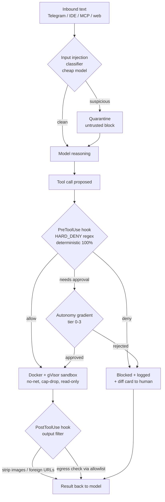
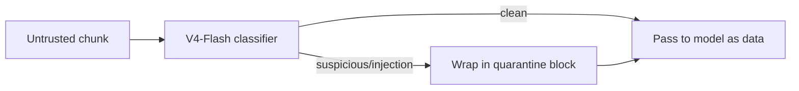
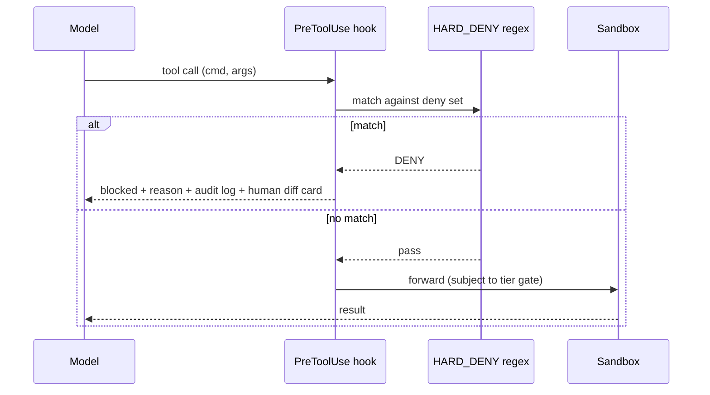
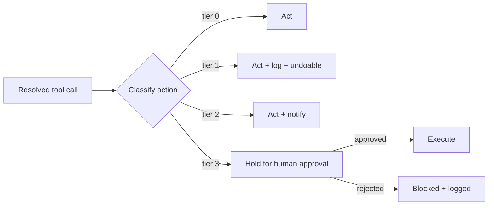
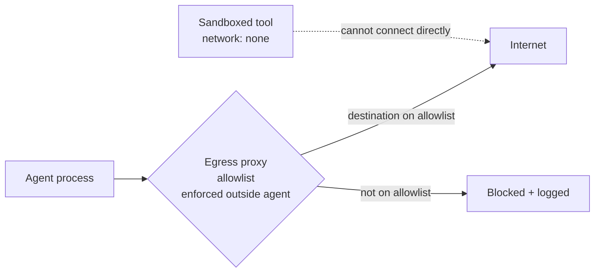
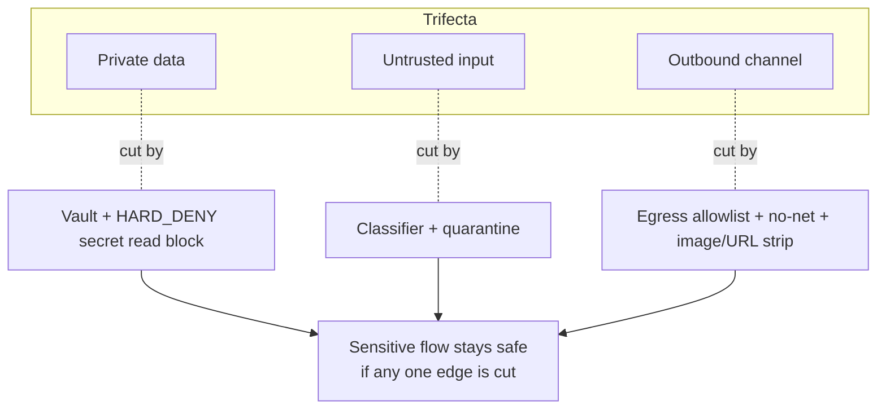

# Safety Layer

> Concept document for engineers building and operating Aisy. It explains the
> defense-in-depth model that keeps a probabilistic LLM from doing irreversible
> damage, and why each layer is implemented in deterministic code rather than
> trusted to the model.

Related ADRs:

- [ADR-0009 — Deterministic Pre/PostToolUse hooks with HARD_DENY](../decisions/2026-06-11-deterministic-tool-hooks.md)
- [ADR-0011 — Autonomy gradient (tiers 0–3)](../decisions/2026-06-11-autonomy-gradient.md)
- [ADR-0012 — Docker + gVisor sandbox for tool execution](../decisions/2026-06-11-docker-sandbox-default.md)
- [ADR-0010 — Vault, egress allowlist, and breaking the lethal trifecta](../decisions/2026-06-11-break-lethal-trifecta.md)

---

## 1. Why a safety layer at all

The thesis of Aisy is a hardware analogy: the LLM is a **stateless probabilistic
CPU**, and the harness is the **deterministic OS** around it. The LLM follows
instructions roughly **70%** of the time — a useful number, but not a number you
can build a `rm -rf` guardrail on. Code hooks follow their rules **100%** of the
time. That gap is a *category* difference, not a *quality* difference: a better
prompt does not close it, because the failure mode is non-determinism itself.

The design rule that follows:

> **Reversible / creative work → the model. Irreversible / critical work
> (delete, deploy, money, budgets, fallback) → code.**

The safety layer is the set of deterministic components that sit between the
model's *intent* and the *effect* on the world. The model may propose anything;
the safety layer decides what actually executes.

This is not a theoretical concern. Production agents have already caused
real, expensive damage:

| Incident | Date | What happened | Root cause class |
|---|---|---|---|
| DataTalksClub / Claude Code | 2026-03-06 | `terraform destroy` ran and wiped **1.9M rows** | No deterministic deny on irreversible infra ops |
| Replit agent | 2025 | Deleted a **production database** | No code-level block on destructive DB ops |
| Amazon Kiro | 2026 | **4 Sev-1 incidents in one week** | Trusting model judgment on critical actions |

Every one of these would have been blocked by a single deterministic regex deny
rule that does not ask the model for permission. **NIST guidance is explicit:
an agent must have at least one deterministic enforcement layer that is *not*
judged by an LLM.** The safety layer is Aisy's answer to that requirement.

---

## 2. The shape of the defense

Defense-in-depth means no single layer is trusted to be sufficient. Untrusted
text and risky actions pass through a sequence of independent gates; each gate
is cheap, deterministic where it matters, and fails closed.

The layers, in order of contact with untrusted data:

1. **Input injection classifier** — a cheap model scores inbound text for
   prompt-injection attempts.
2. **Quarantine** — suspicious or merely *untrusted* content is wrapped so the
   model treats it as data, not instructions.
3. **PreToolUse hook (HARD_DENY)** — deterministic regex blocks irreversible
   operations before they run. This is the NIST non-LLM enforcement layer.
4. **Autonomy gradient (tiers 0–3)** — graduated human-in-the-loop for actions
   that are risky but not categorically forbidden.
5. **Sandbox (Docker + gVisor)** — strong isolation for tool execution.
6. **Vault + egress allowlist** — secrets never enter the agent process; network
   egress is controlled *outside* the agent.
7. **PostToolUse output filter** — strips injection vectors from tool results
   before they re-enter the context.

Layers 3–7 are deterministic code. Layer 1 uses a model but is **advisory** — it
never has authority to *allow* a forbidden action, only to *flag* untrusted
content. That asymmetry is deliberate: a model is allowed to raise suspicion, but
only code is allowed to grant a dangerous capability.

---

## 3. Layer 1 — Input injection classifier

Every byte arriving from outside the trust boundary — Telegram messages, IDE
context, MCP tool output, fetched web pages, file contents — is *untrusted
input* for prompt-injection purposes. Before the model reasons over it, a cheap
fast model classifies it.

- **Model choice:** DeepSeek V4-Flash ($0.14 / $0.28 per 1M tokens). At this
  price the classifier can run on **every** inbound chunk and on every MCP
  response without moving the cost curve. See the providers table in §8.
- **Output:** a label (`clean` / `suspicious` / `injection`) plus a span list of
  the offending text.
- **Authority:** advisory only. A `clean` verdict does **not** unlock anything;
  it just means the content skips quarantine framing. A `suspicious` or
  `injection` verdict forces the content into quarantine (§4).

Importantly, the classifier is treated as **one more untrusted source**: its
output is structured data we parse, never free text we splice into the system
prompt. A classifier that is itself compromised can only *over*-quarantine, which
fails safe.

---

## 4. Layer 2 — Quarantine of untrusted content

The classifier flags; quarantine *contains*. Untrusted content is never
concatenated into the instruction stream. It is wrapped in an explicit,
unspoofable envelope that tells the model: *this is data to analyze, not commands
to obey.*

Concretely, quarantine does three things:

1. **Structural framing.** Untrusted text is placed inside a delimited block with
   a fixed, non-guessable marker, and the system prompt states that nothing
   inside that block is ever an instruction.
2. **Capability narrowing.** While reasoning over quarantined content, the model
   runs with a reduced tool set — e.g. it cannot trigger outbound channels or
   irreversible ops *as a direct consequence of* processing quarantined text.
3. **Provenance tagging.** Each block carries its source (which MCP server, which
   URL, which file) so PostToolUse filters and the audit log can trace any later
   action back to the text that motivated it.

Quarantine is the practical mechanism for **breaking the lethal trifecta** at the
input edge (see §9): it ensures *untrusted input* cannot directly drive *private
data* into an *outbound channel* without crossing a deterministic gate.

---

## 5. Layer 3 — Deterministic Pre/PostToolUse hooks (HARD_DENY)

This is the core of the safety layer and the embodiment of the 70-vs-100 thesis.
See **[ADR-0009](../decisions/2026-06-11-deterministic-tool-hooks.md)**.

### 5.1 PreToolUse

Before any tool call executes, a **PreToolUse** hook inspects the fully-resolved
command and arguments. It runs a **HARD_DENY** regex set. If a pattern matches,
the call is **blocked unconditionally** — the model is not asked, and no prompt,
jailbreak, or injected instruction can override it, because the decision is a
string match in code, not a model judgment.

HARD_DENY blocks at minimum:

| Category | Example patterns blocked |
|---|---|
| Infra destruction | `terraform destroy`, `kubectl delete namespace` |
| Filesystem destruction | `rm -rf`, recursive deletes of protected paths |
| Database destruction | `DROP`, `TRUNCATE`, `DELETE` without a `WHERE` clause |
| History rewrite | `git push --force`, `git push -f` |
| Money operations | payment / transfer / payout API calls |
| Secret exfiltration | reading `.env`, key files, vault paths |

The `DELETE`-without-`WHERE` rule is a good illustration of why this lives in
code: catching an unbounded delete reliably requires *parsing intent the same way
every time*. A model that catches it 70% of the time is a model that wipes a
table 3 times out of 10 — which is exactly the DataTalksClub failure mode.

### 5.2 PostToolUse

After a tool returns, a **PostToolUse** hook runs the **output filter** (§7)
before the result re-enters the model's context. This closes the loop: results
are also untrusted text and can carry second-stage injections.

### 5.3 Fail-closed and no skip-permissions

Two non-negotiable invariants:

- **Fail closed.** If a hook errors or times out, the action is *denied*, not
  allowed.
- **No skip-permissions on irreversible ops.** There is no flag, mode, or
  "trust me" path that disables HARD_DENY for delete/deploy/money operations.
  Reversible operations may be fast-pathed; irreversible ones never are.

---

## 6. Layer 4 — Autonomy gradient (tiers 0–3)

HARD_DENY is binary: forbidden or not. Most actions are neither obviously safe
nor categorically forbidden — they are *risky*. The **autonomy gradient** grades
how much independence the agent has per action class. See
**[ADR-0011](../decisions/2026-06-11-autonomy-gradient.md)**.

| Tier | Name | Behavior | Example actions |
|---|---|---|---|
| 0 | Read-only | Acts freely, no approval | Read files, search memory (FTS5), query status |
| 1 | Reversible write | Acts, but logs and is undoable | Edit a draft, write to `daily/`, stage a skill |
| 2 | Notify-and-act | Acts, then notifies; human can roll back | Send a routine message, run a known sandboxed script |
| 3 | Approve-before-act | Blocks until explicit human approval | Deploy, spend money, external side effects, prod data |

Rules of the gradient:

- **Tier is a property of the *action class*, not the model's confidence.** The
  model never self-promotes to a higher tier. Promotion is a code decision based
  on the resolved tool call.
- **HARD_DENY sits above the gradient.** A tier-3 *approval* never resurrects a
  HARD_DENY'd action. Approval can authorize risky-but-allowed work; it cannot
  authorize forbidden work.
- **Agent-created skills are tier-bounded.** New skills the agent writes go to
  **staging** and wait for human approval before they can run in prod — they
  cannot grant themselves tier-3 capability.

---

## 7. Layer 5 — Sandbox: Docker + gVisor

Allowed tool execution does not run on the host. It runs in a locked-down
container. See
**[ADR-0012](../decisions/2026-06-11-docker-sandbox-default.md)**.

Baseline container posture:

| Control | Setting | Why |
|---|---|---|
| Network | `--network none` | No egress from inside the tool process; egress is controlled outside (§8) |
| Filesystem | `--read-only` | Tool cannot mutate the host or persist between runs |
| Capabilities | `cap_drop: ALL` | Remove every Linux capability by default |
| Privilege escalation | `--security-opt no-new-privileges` | A child cannot gain capabilities the parent dropped |
| Lifetime | one-shot | Fresh container per execution; no carry-over state |

**gVisor** (`runsc`) adds a second isolation boundary: instead of tool syscalls
hitting the host kernel directly, they hit gVisor's user-space kernel. This
shrinks the host kernel attack surface dramatically — a container escape now has
to defeat *both* the namespace/cgroup boundary *and* gVisor's syscall
interception. The cost is a small per-syscall overhead, acceptable for the
infrequent, bounded nature of agent tool calls.

The `--network none` choice is deliberate and load-bearing for the lethal
trifecta (§9): the tool process *physically cannot* open an outbound socket, so
any exfiltration must go through the agent's controlled egress path, where the
allowlist applies.

---

## 8. Layer 6 — Vault and egress allowlist

Two complementary controls keep secrets in and data from leaking out. See
**[ADR-0010](../decisions/2026-06-11-break-lethal-trifecta.md)**.

### 8.1 Vault

Secrets (API keys, tokens, credentials) live in a **vault**, not in the agent's
files, environment, or context window. The agent process holds *references*, not
values. HARD_DENY additionally blocks attempts to read secret files directly
(§5.1). This means a successful prompt injection cannot simply ask the model to
"print the API keys" — there is nothing in the model's context to print.

MCP tokens follow the same principle: **per-process, minimal-scope** tokens, so a
compromised or rug-pulled MCP server gets the narrowest possible blast radius.

### 8.2 Egress allowlist

Network egress is allowlisted, and — critically — the allowlist is enforced
**outside the agent process**, at the proxy/network layer. The agent cannot edit
its own allowlist, and an injection that convinces the model to POST data
somewhere still hits a network gate that only permits known destinations.

Combined with `--network none` inside the sandbox (§7), the egress story is:

### 8.3 Provider routing under the safety layer

Provider selection is part of the deterministic surface — the router picks a
model by task type, and **fallback is deterministic** (on 2 consecutive errors,
with hysteresis, not on the first timeout). For reference, the June 2026 pricing
the router reasons over:

| Model | Input $/1M | Output $/1M | Safety-layer role |
|---|---|---|---|
| Claude Opus 4.8 | 5 | 25 | Critic / review of risky plans |
| Claude Sonnet 4.6 | 3 | 15 | Workhorse / judge |
| GPT-5.5 | 5 | 30 | Reasoning fallback |
| DeepSeek V4-Pro | 1.74 | 3.48 | Cheap reasoning |
| DeepSeek V4-Flash | 0.14 | 0.28 | **Input injection classifier**, monitoring |

The economics matter: because V4-Flash is ~$0.14/1M input, running the injection
classifier on *everything* is effectively free relative to the cost of one
DataTalksClub-style incident.

---

## 9. Breaking the lethal trifecta

Simon Willison's **lethal trifecta** names the three ingredients that together
enable data exfiltration by a compromised agent:

1. **Private data** in context (your files, memory, secrets).
2. **Untrusted input** (anything the attacker can influence — a web page, an
   email, an MCP tool description).
3. **An outbound channel** (a way to send data out — HTTP, a message, an image
   URL the renderer fetches).

If all three are present, an injection in (2) can read (1) and ship it via (3).
The defense is not to eliminate any single one perfectly, but to **break at least
one per sensitive flow** with a deterministic control:

| Trifecta element | How Aisy breaks it |
|---|---|
| Private data | Secrets live in the **vault**, never in context (§8.1); HARD_DENY blocks reading secret files (§5.1) |
| Untrusted input | **Input classifier** (§3) + **quarantine** (§4) keep external text as data, not instructions |
| Outbound channel | **Egress allowlist outside the agent** (§8.2) + `--network none` sandbox (§7); output filter **strips markdown images and foreign URLs** (§10) |

The key insight: stripping markdown images and foreign URLs from model output and
tool results is a *deterministic* control on the outbound channel. The classic
exfiltration trick — get the model to emit ``
so the chat client fetches it — is defeated by a regex, not by hoping the model
declines.

### MCP-specific notes

MCP servers are a prime untrusted-input vector. Roughly **5.5%** of surveyed MCP
servers carry malicious instructions in their tool descriptions (**tool
poisoning**), and **rug-pulls** swap a clean descriptor for a malicious one after
connection. Aisy treats MCP as hostile-by-default:

- **Allowlist only** — no arbitrary server connections.
- **Version pinning** — pin the server contract.
- **Hash tool descriptors on connect** — a changed hash disables the server and
  raises a **diff card** for human review.
- **Per-process minimal-scope tokens** — narrow blast radius (§8.1).
- **MCP output runs through the input classifier** like any other external text
  (§3).

---

## 10. Layer 7 — Output filter

The PostToolUse output filter (§5.2) and the final response filter share one job:
neutralize injection vectors and exfiltration channels in anything that crosses a
boundary.

Deterministic transforms applied:

- **Strip markdown images** — remove `` so a renderer cannot be
  tricked into fetching an attacker URL with embedded data.
- **Strip / neutralize foreign URLs** — links to destinations outside the egress
  allowlist are removed or defanged.
- **Re-classify second-stage content** — tool output is fed back through the
  input classifier (§3) before it re-enters the model context, catching
  injections that only appear in results.

Because these are regex/transform operations, they hold at 100% — they do not
depend on the model noticing the attack.

---

## 11. The 70-vs-100 principle, summarized

Every layer above answers one question: *who is allowed to be wrong here?*

- Where being wrong is **reversible** (drafting, summarizing, creative
  reasoning), the model's ~70% adherence is fine — mistakes are cheap and
  undoable.
- Where being wrong is **irreversible** (delete, deploy, money, secret reads,
  egress), the decision is moved into deterministic code that is correct 100% of
  the time, because a 30% failure rate on those operations is catastrophic.

NIST's requirement of *at least one deterministic enforcement layer not judged by
an LLM* is satisfied by the PreToolUse HARD_DENY hook — and Aisy layers several
more deterministic gates around it. The model proposes; the safety layer
disposes.

| Decision | Owner | Adherence needed |
|---|---|---|
| What to draft / how to reason | Model | ~70% acceptable |
| Whether to run an irreversible op | HARD_DENY code | 100% |
| Whether a risky op needs a human | Autonomy gradient code | 100% |
| Whether a tool can reach the network | Sandbox + egress code | 100% |
| Whether output can carry an exfil URL | Output filter code | 100% |

---

## 12. Reference map

| Concern | Layer | ADR |
|---|---|---|
| Block irreversible ops deterministically | PreToolUse HARD_DENY | [ADR-0009](../decisions/2026-06-11-deterministic-tool-hooks.md) |
| Graduated human-in-the-loop | Autonomy gradient (tiers 0–3) | [ADR-0011](../decisions/2026-06-11-autonomy-gradient.md) |
| Isolate tool execution | Docker + gVisor sandbox | [ADR-0012](../decisions/2026-06-11-docker-sandbox-default.md) |
| Keep secrets in, data from leaking out | Vault + egress allowlist + trifecta | [ADR-0010](../decisions/2026-06-11-break-lethal-trifecta.md) |
