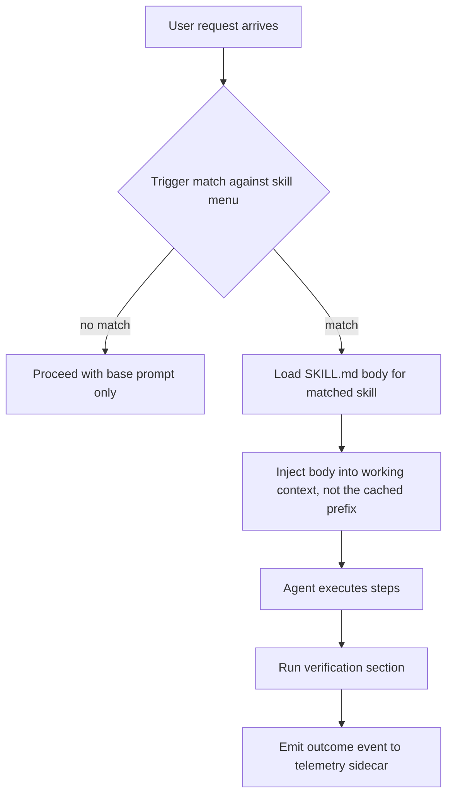
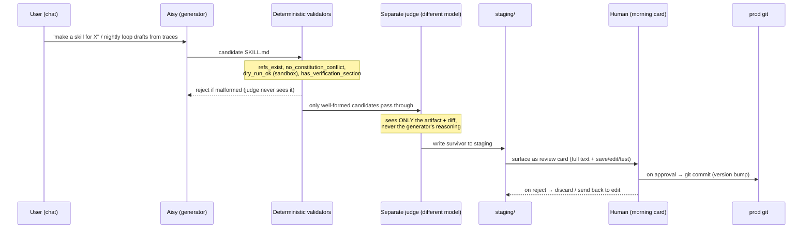
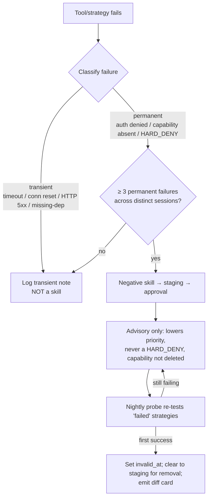
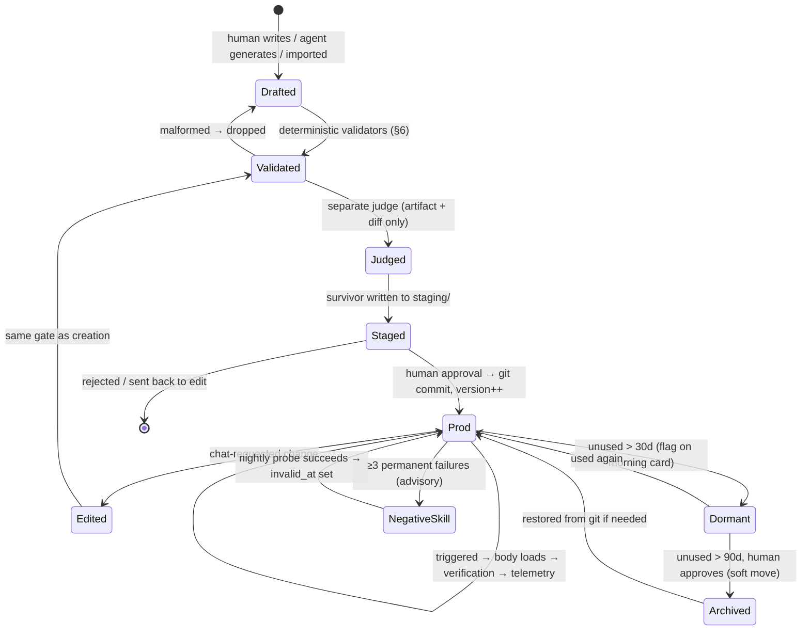

# Skill Lifecycle

> Concept doc for engineers working on Aisy's procedural-memory layer.
> Companion ADRs: [ADR-0015 Skill Format + Staged Creation](../decisions/2026-06-11-skill-format-staged-creation.md),
> [ADR-0016 Generator + Separate Judge for Self-Learning](../decisions/2026-06-11-generator-judge-self-learning.md),
> [ADR-0025 Transient-vs-Permanent Failure for Skills](../decisions/2026-06-11-transient-vs-permanent-skill-failure.md).

## 1. What a skill is

A **skill** is Aisy's unit of *procedural* memory — a reusable "how to" recipe the
agent loads on demand. Where the file-based memory layer answers *"what do I know?"*,
skills answer *"how do I do this?"*. A skill is a single `SKILL.md` file: human-readable
Markdown with a YAML frontmatter contract. The format is deliberately the same one the
wider ecosystem uses (Claude Code, anima_sdk), so a skill is a portable artifact, not a
bespoke internal blob.

Two hard pressures shape everything below:

| Pressure | Consequence |
|---|---|
| **Prompt budget.** The always-loaded prefix is already ~9–10k tokens. | We cannot inline skill bodies; only a menu (name + description) lives in the prompt. |
| **Self-improvement safety.** The nightly loop lets the agent *author* skills. | A ~70%-adherent model cannot be the final gate on what becomes durable behavior. Agent-authored skills go to staging and wait for a human. |

The category split that runs through the whole harness applies here too: the *creative*
act of drafting a skill is a job for the model; the *irreversible* act of promoting it to
prod procedural memory is a job for deterministic code plus a human.

## 2. The `SKILL.md` format

### 2.1 Frontmatter contract

The frontmatter is the machine-readable contract. Every field exists to serve loading,
routing, provenance, or safety.

```yaml
---
name: deploy-preview              # stable id, used by triggers + telemetry join key
description: Ship a Vercel preview and post the URL   # ≤ 60 chars — this is the menu line
version: 3                        # bumped on every approved edit; matches git history
provenance: agent-authored        # human | agent-authored | imported
triggers:                         # drive lazy loading; matched against the request
  - deploy preview
  - vercel preview
  - ship a branch
---
```

| Field | Required | Why it exists |
|---|---|---|
| `name` | yes | Stable identifier; the join key for sidecar telemetry. |
| `description` | yes, **≤ 60 chars** | This single line is what sits in the prompt menu. The cap keeps the always-loaded menu cheap. |
| `version` | yes | Incremented on each approved edit; mirrors the git commit chain. |
| `provenance` | yes | Records origin — `human`, `agent-authored`, or `imported`. Drives review strictness and trust-gradient eligibility. |
| `triggers` | yes | Phrases/intents matched at runtime to decide *when* the body loads. |

### 2.2 The mandatory `verification` section

The body is free-form Markdown — steps, code, gotchas — with **one required section:
`verification`**. A skill that has no way to check its own success is *rejected at save
time*. This is enforced by the deterministic `has_verification_section` validator
(see §6), not by prompt convention.

```markdown
## verification
- `vercel ls` shows the new deployment as `Ready`.
- The preview URL returns HTTP 200 within 30s.
- The posted message contains a `*.vercel.app` URL, not a localhost link.
```

The verification section is what lets a skill be *judged by its trace* rather than by a
model's self-report. It is the contract that closes the loop between "I ran the recipe"
and "the recipe actually worked."

## 3. Menu-in-prompt vs body-on-trigger

A skill is never loaded whole into the prompt. Only the **menu** — `name` +
`description` per skill — lives in the always-loaded region. The **body** loads lazily on
trigger. This mirrors the three-step lazy memory-loading pattern and, crucially, keeps
skill cost *off* the byte-identical KV-cache prefix: skills that load mid-session do not
mutate the cached prefix, so cache reuse survives.



### Token math

The economics are the whole reason for the split. Inlining every body would tax the
always-loaded prefix and bloat the cached region; the menu approach keeps the resident
cost flat regardless of library size.

| Strategy | Resident prompt cost (50 skills) | KV-cache impact |
|---|---|---|
| Inline all bodies | ~50 × ~500 tok ≈ **25,000 tok**, always resident | Bodies sit in the cached prefix; any change busts the cache |
| **Menu + body-on-trigger** | 50 × ~12 tok ≈ **~600 tok** menu, resident | Prefix stays byte-identical; bodies load into working context only |

The menu is ~2.4% of the inline cost, and — more important — it does not move, so the
KV-cache prefix stays valid all session.

## 4. Creation and editing via chat

Skills come into being three ways: a human writes one, a skill is imported, or — the
interesting case — **the agent authors one from the day's traces**. The agent-authored
path is governed by ADR-0015 and ADR-0016 and is the reason staging exists.



### 4.1 Why staging is non-negotiable

Writing agent-generated skills straight to prod is exactly how Hermes fossilized a
transient failure into learned helplessness (issue #6051): a one-off error became a
permanent "I can't do this" recipe with no human ever in the loop. A ~70%-adherent model
cannot be the final gate on what becomes durable behavior, so:

- **Generator** (cheap routine model, DeepSeek V4-Flash) drafts candidates. Drafting is
  high-volume work; it gets the cheapest model.
- **Deterministic validators run *first*** and gate anything malformed with 100%
  reliability — see §6. The judge never wastes tokens on broken candidates.
- **A separate judge** (a *different* model, e.g. Sonnet 4.6) validates survivors. It
  sees only the final artifact and its diff — never the generator's chain-of-thought — so
  it cannot be primed or talked into a pass. Using a different provider avoids shared
  blind spots: the judge is not the defendant.
- **Human gate.** Survivors land in `staging/` and surface in the **morning card** with
  full text and `save / edit / test` actions. Only on approval is the skill committed to
  prod git. The deterministic gate — not the model — decides what becomes procedural
  memory.

### 4.2 Edits

An edit follows the same path. The chat asks for a change; the generator produces a new
`SKILL.md`; validators and judge run; the diff (not the whole file) is what the human
reviews on the card. Approval bumps `version` and is a fresh git commit. Every approved
save is therefore auditable and revertible — the skill's evolution is its git history.

### 4.3 Trust gradient (deferred)

Once a *category* of skills accumulates a track record of clean approvals, low-risk
categories (formatting rules, annotation tweaks) may eventually auto-commit. Irreversible
or safety-touching categories never do. This is explicitly deferred in ADR-0016 — it is
earned, not assumed.

## 5. Telemetry sidecar

Usage data lives in a **sidecar store, never in `SKILL.md`**. This is a deliberate
separation of concerns:

- The `SKILL.md` file stays a clean, diffable, shareable artifact. Hit counts churning
  inside it would make every git diff noise and break ecosystem interop.
- The always-loaded menu stays *stable* for KV-cache reuse. If telemetry mutated the file,
  it would mutate the prefix and bust the cache.

The sidecar (joined to skills by `name`) records, per skill:

| Metric | Used for |
|---|---|
| `hit_count` | Hygiene: distinguishes "never useful" from "load-bearing". |
| `last_used_at` | Hygiene windows (§7) — the 30/90-day clocks. |
| `failure_rate` | Quality signal; feeds the transient-vs-permanent logic (§7). |
| `last_outcome` | Whether the most recent run passed its own `verification`. |

Telemetry is *observational*. It informs hygiene and self-learning; it never mutates a
skill or makes a promotion decision on its own.

## 6. Deterministic validators

These run before the judge and before any human sees a candidate. Each is plain code, so
each enforces at 100% — unlike a ~70%-adherent prompt. NIST guidance requires at least one
deterministic enforcement layer not judged by an LLM; this is it.

| Validator | Checks | On failure |
|---|---|---|
| `refs_exist` | Every referenced file/skill/tool resolves. | Drop candidate. |
| `no_constitution_conflict` | No rule contradicts `constitution.md`. | Drop candidate. |
| `dry_run_ok` | Body executes in the network-none, read-only, one-shot sandbox. | Drop candidate. |
| `has_verification_section` | The mandatory `verification` section is present. | Drop candidate. |

A candidate that fails any of these is dropped *before* the judge — the judge spends
tokens only on plausible artifacts. This is the "code catches what code can catch" layer;
the judge handles semantic quality the validators cannot.

## 7. Hygiene and the failure rule

A skill library that only grows becomes a liability: stale recipes pollute the trigger
menu and fossilized negative skills permanently blind the agent. Two mechanisms keep the
library healthy.

### 7.1 Hygiene windows (30 / 90 days)

The nightly loop runs a hygiene pass over the telemetry sidecar.

| Age since `last_used_at` | Action |
|---|---|
| **≤ 30 days** | Active. No action. |
| **> 30 days, unused** | Flag as **dormant**; surface on the morning card for review. Stays loadable. |
| **> 90 days, unused** | Propose **archival** to `staging/`. Human approves the move; nothing is hard-deleted. Archived skills are recoverable from git. |

Hygiene *proposes*; the human disposes. Archival is a soft move (out of the live menu,
into archive), not a destruction — consistent with the durable-forgetting posture of the
memory layer.

### 7.2 The transient-vs-permanent failure rule

This is the subtle one, and it is the direct fix for Hermes #6051. A skill can encode a
*negative* lesson — "tool X is unreliable, avoid it." That is dangerous when the evidence
is a single failure: after one transient Playwright outage, the Hermes agent wrote a skill
asserting "browser tools non-functional" and kept routing around the browser *even after
the tool came back online*. A recoverable hiccup became a permanent capability loss —
classic learned helplessness. The negative skill was never re-tested.

ADR-0025 forbids fossilizing a negative skill from a single failure:



The rules, concretely:

| Rule | Detail |
|---|---|
| **Evidence threshold** | A negative skill requires **N ≥ 3** failures across *distinct sessions*. Below threshold it is a transient note, never a skill. |
| **Failure classification** | Each failure is tagged *transient* (timeout, connection reset, HTTP 5xx, missing-dependency) vs *permanent* (auth denied, capability genuinely absent, HARD_DENY). Only repeated permanent-class signals justify a negative skill. |
| **No permanent veto** | Even an approved negative skill is *advisory*. It lowers a strategy's priority; it never deletes the capability or becomes a HARD_DENY. |
| **Retry/sample probe** | A background probe (nightly loop, on the cheap V4-Flash model) periodically re-tests strategies marked "failed." The **first success** un-fossilizes the skill — this is the valve #6051 lacked. |
| **Bi-temporal record** | Negative skills carry `valid_at` / `invalid_at` like memory facts. A probe success sets `invalid_at` instead of hard-deleting, with hysteresis on the threshold so a flaky tool does not oscillate. |

We deliberately do *not* let an LLM judge decide transient-vs-permanent per failure as the
sole gate: at ~70% adherence it is exactly the unreliable layer NIST says must not be the
gate, and it would re-introduce non-determinism into the un-fossilize decision. The model
may *hint*; the deterministic threshold + probe *decide*.

## 8. Full lifecycle at a glance



## 9. Invariants (what must always hold)

These are the load-bearing guarantees an implementation must not violate:

1. **The menu is the only thing in the prompt.** Bodies load on trigger and never enter
   the cached prefix. (ADR-0015)
2. **`description` ≤ 60 chars.** The menu line is the budget; the cap is enforced, not
   advised. (ADR-0015)
3. **`verification` section is mandatory.** No verification → rejected at save. (ADR-0015,
   ADR-0016)
4. **Telemetry lives in the sidecar, never in `SKILL.md`.** Keeps the file diffable and
   the prefix stable. (ADR-0015)
5. **No agent-authored skill reaches prod without a human.** Generator → deterministic
   validators → separate judge → staging → human approval → git commit. The model never
   self-promotes. (ADR-0015, ADR-0016)
6. **The judge is independent of the generator.** Different model, sees only the artifact
   and diff — never the generator's reasoning. (ADR-0016)
7. **Deterministic validators run before the judge and enforce at 100%.** At least one
   non-LLM enforcement layer, per NIST. (ADR-0016)
8. **A single failure never fossilizes a negative skill.** N ≥ 3 permanent-class failures
   across sessions; negative skills are advisory and bi-temporal; a nightly probe
   un-fossilizes them. (ADR-0025)
9. **Hygiene is soft.** Dormancy and archival propose; the human disposes; nothing is
   hard-deleted (recoverable from git).

## 10. Cross-references

| Concern | ADR |
|---|---|
| Skill format, menu/body split, sidecar telemetry, staging gate | [ADR-0015](../decisions/2026-06-11-skill-format-staged-creation.md) |
| Generator + deterministic validators + separate judge, nightly loop | [ADR-0016](../decisions/2026-06-11-generator-judge-self-learning.md) |
| Transient-vs-permanent failure rule, un-fossilize probe | [ADR-0025](../decisions/2026-06-11-transient-vs-permanent-skill-failure.md) |
| Bi-temporal facts, soft-delete (memory twin of the failure rule) | [ADR-0023](../decisions/2026-06-11-durable-forgetting-tombstones.md) |
| Three-step lazy loading (the pattern menu/body mirrors) | [ADR-0008](../decisions/2026-06-11-three-step-lazy-memory-loading.md) |
| Stable-prefix KV-cache (why the menu must not move) | [ADR-0019](../decisions/2026-06-11-stable-prefix-kv-cache.md) |
| Docker sandbox used by the `dry_run_ok` validator | [ADR-0012](../decisions/2026-06-11-docker-sandbox-default.md) |
